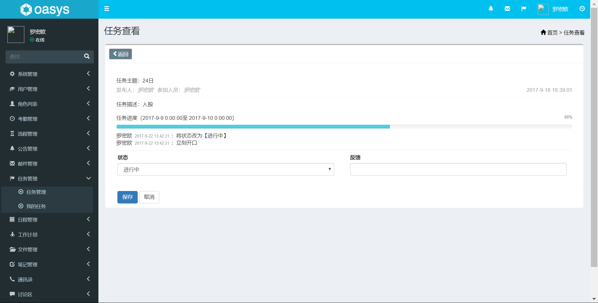
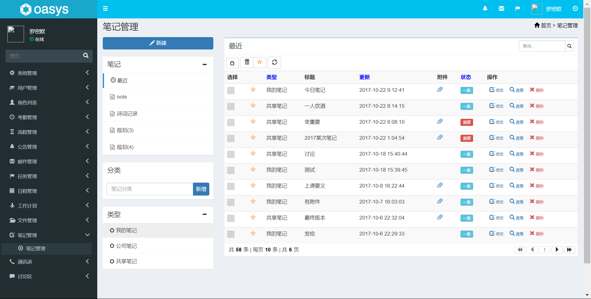
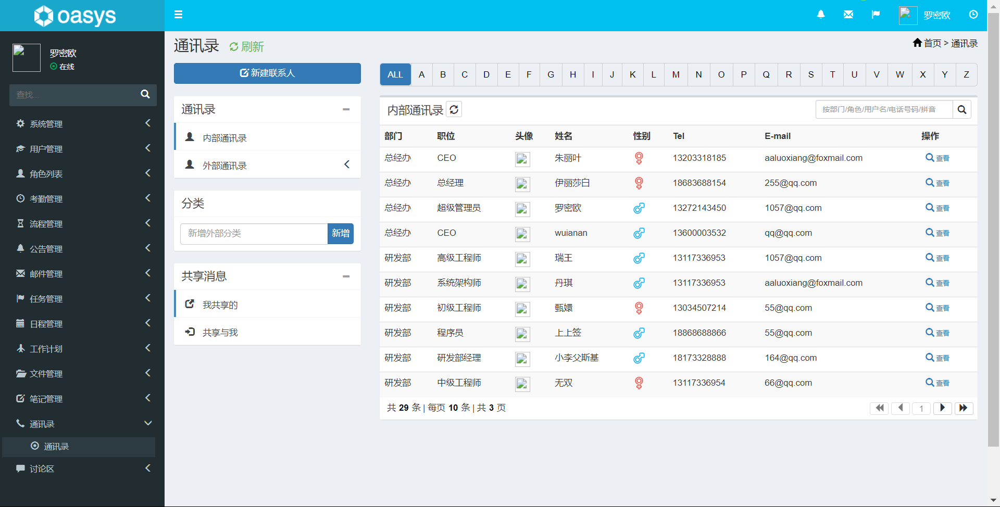
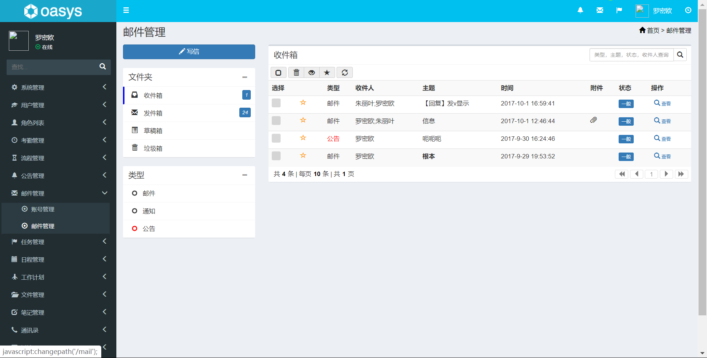
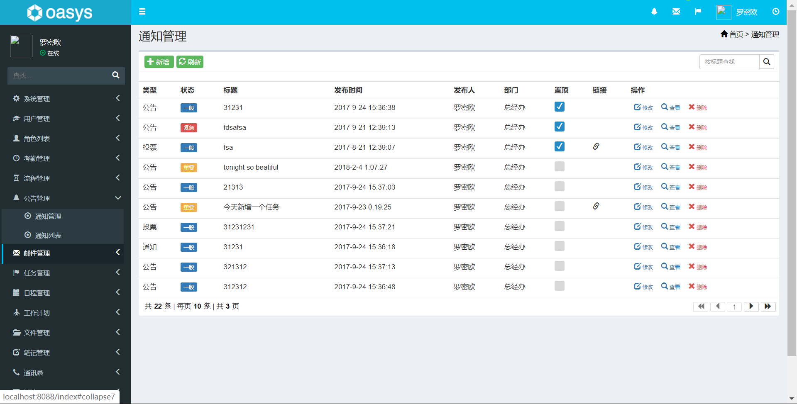
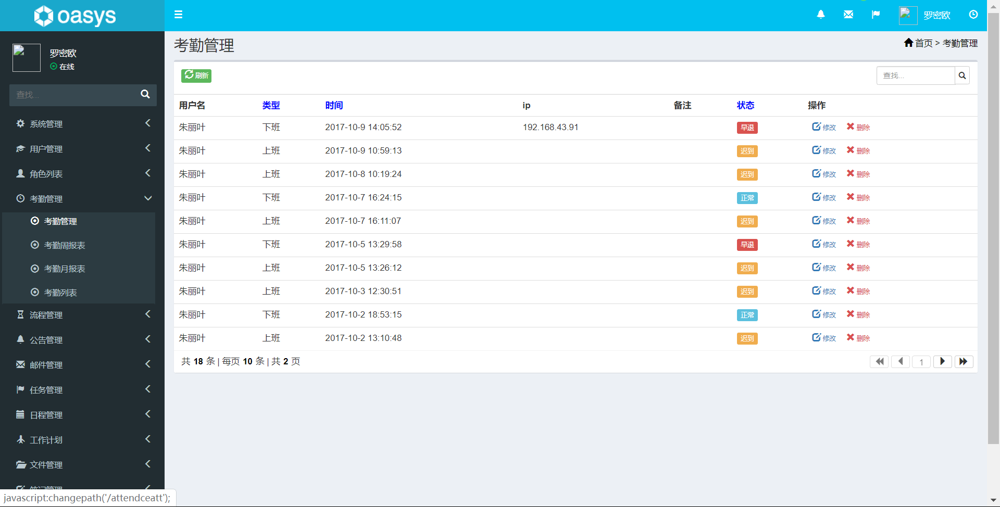
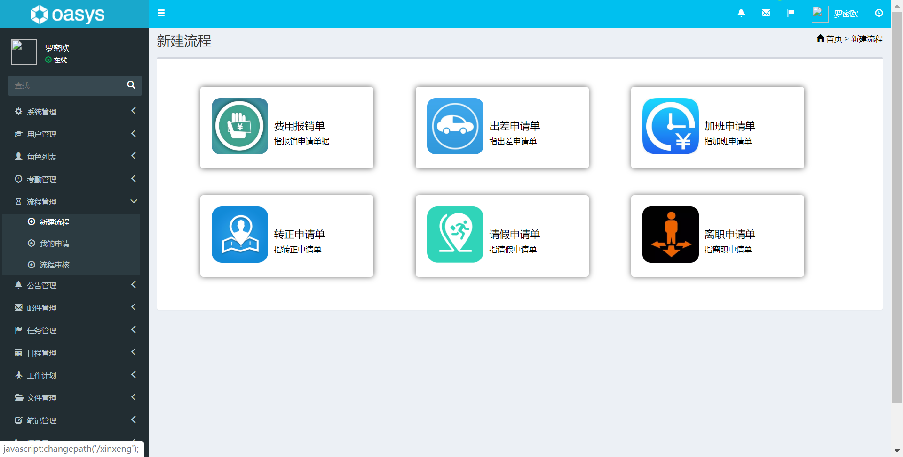
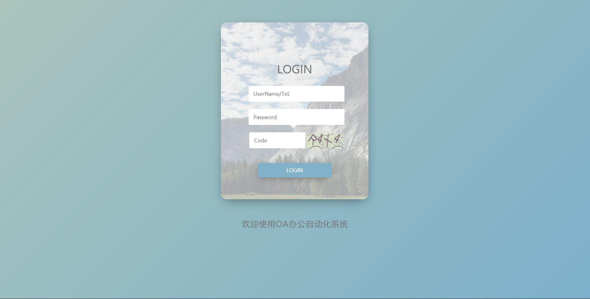
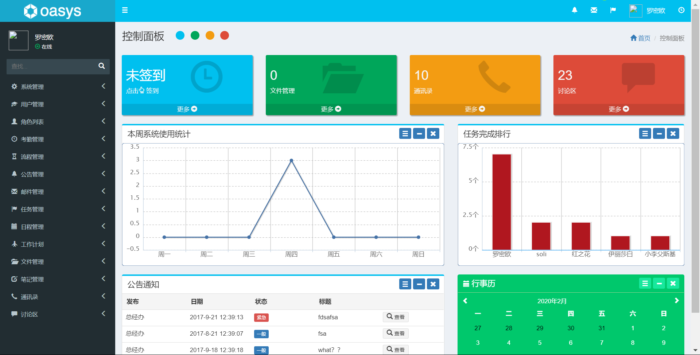
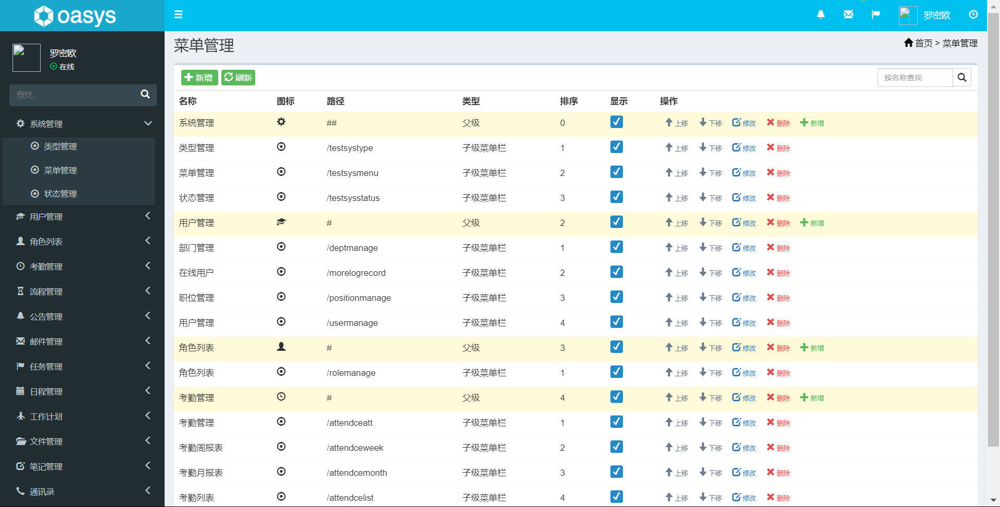

# 基于SpringBoot的OA办公系统

#### 介绍
oasys是一个OA办公自动化系统，使用Maven进行项目管理，基于springboot框架开发的项目，mysql底层数据库，前端采用freemarker模板引擎，Bootstrap作为前端UI框架，集成了jpa、mybatis等框架。作为初学springboot的同学是一个很不错的项目

#### 软件架构
前端：html | jquery | bootstrap  
后端：spring boot | springmvc | mybatis  
环境：jdk1.8 | maven | mysql | tomcat      

#### 功能介绍

##### 【功能详述】 

- 任务查看

    

- 笔记管理

    

- 通讯录

    

- 邮件管理

    

- 同志管理

    

- 考勤管理

    

- 新建流程

    

- 登陆

    

- 控制面板

    

- 菜单管理

    

#### 使用说明
1. 创建数据库，执行数据库脚本  
2. 修改jdbc数据库连接参数  
3. 下载安装maven依赖jar  
4. 启动SpringBoot启动类  

#### 后端管理

请求地址： http://localhost:8080/

用户名：admin

密码：123456   